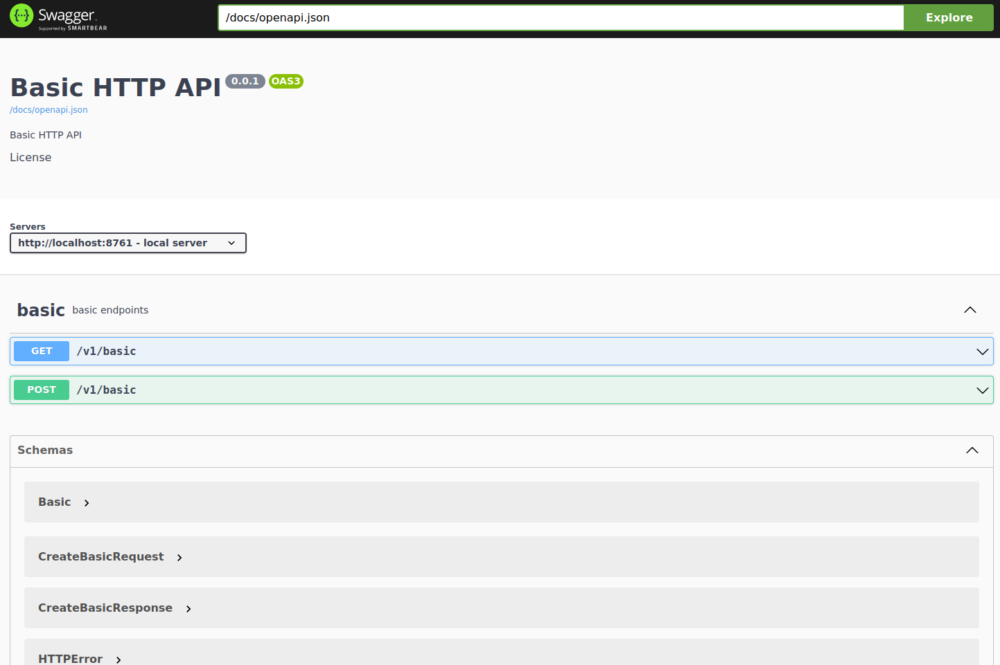

# Rust gRPC and HTTP Integration

[Medium - Rust gRPC and HTTP Integration](https://ralvescosta.medium.com/grpc-and-http-integration-in-rust-3f18c2f9d94f)

## HTTP Server - OpenAPI Doc

<p align="center">
  
</p>


## How Can I possibly run this project?

- First of all you need to configure your rust environment with rustup, rustc and cargo.
- Second of all you need to configure and allow makefile scripts in your environment.
- Make sure you have the ports 50051 (gRPC) and 8761 (HTTP) free to use.

- To run the **gRPC Server** execute this command bellow:

```bash
make grpc
```

- To run the **HTTP Server** execute hits command bellow:

```bash
make http-server
```

- You can access the **OpenAPI documentation** in your browser: http://localhost:8761/docs/